# Getting SFML Running on M1 Mac
## Step 1: Install Brew Package Manager
```
/bin/bash -c "$(curl -fsSL https://raw.githubusercontent.com/Homebrew/install/master/install.sh)"
```

```
echo "export PATH=/opt/homebrew/bin:$PATH" >> ~/.zshrc
```

```
source ~/.zshrc
```

## Step 2: Install SFML
```
brew install sfml
```

## Step 3: Find Install location
```
brew info sfml
```
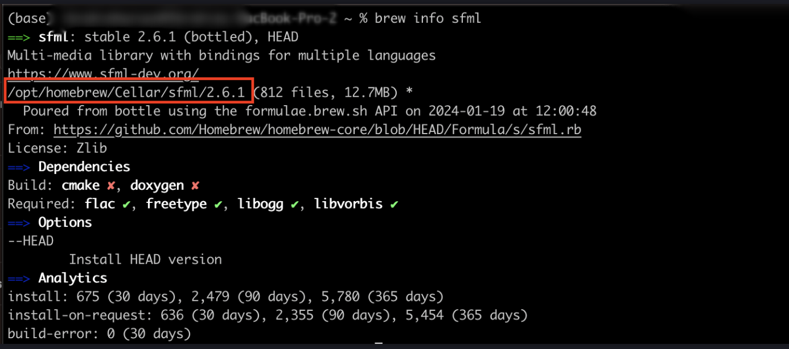

## Step 4: Create a test XCode Project
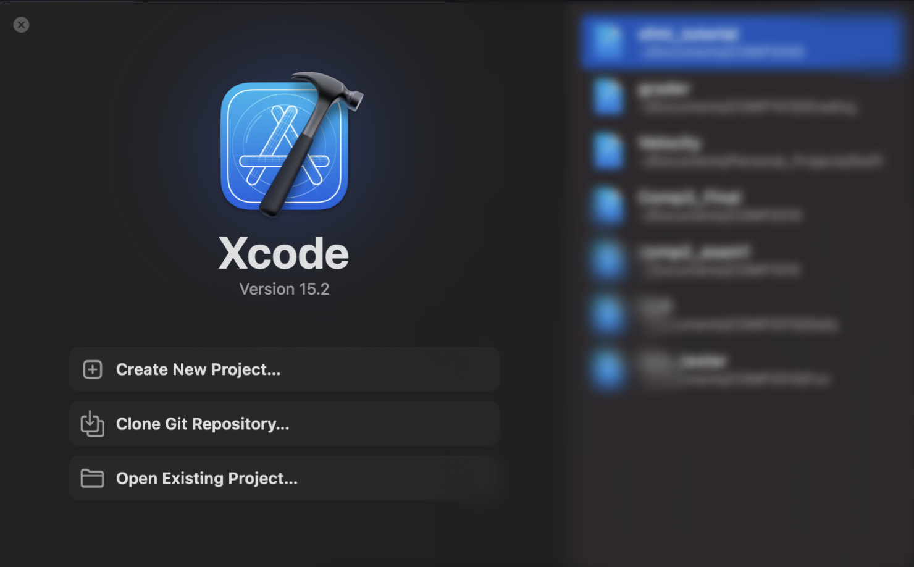
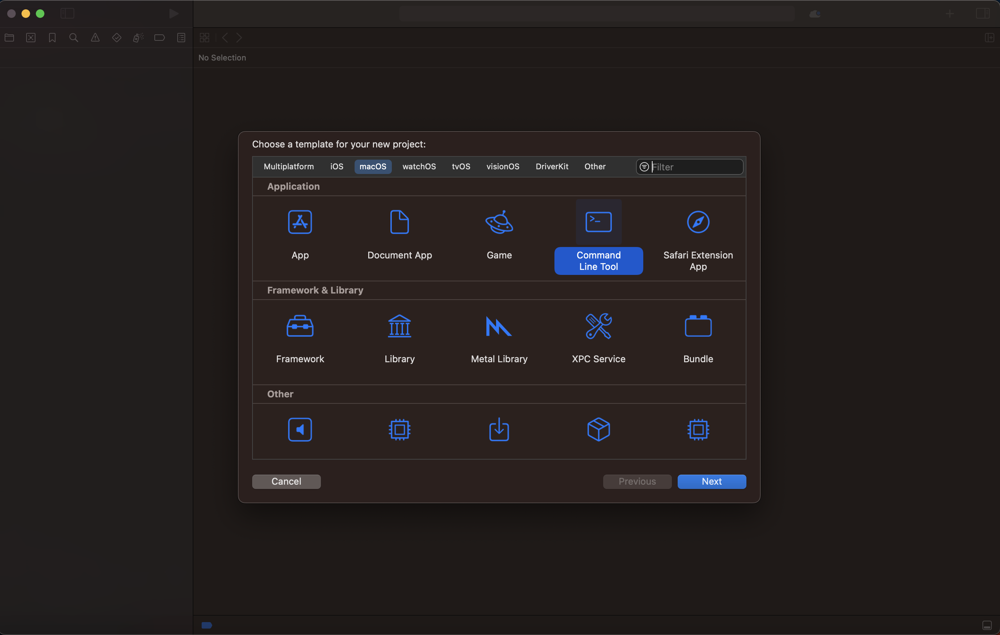
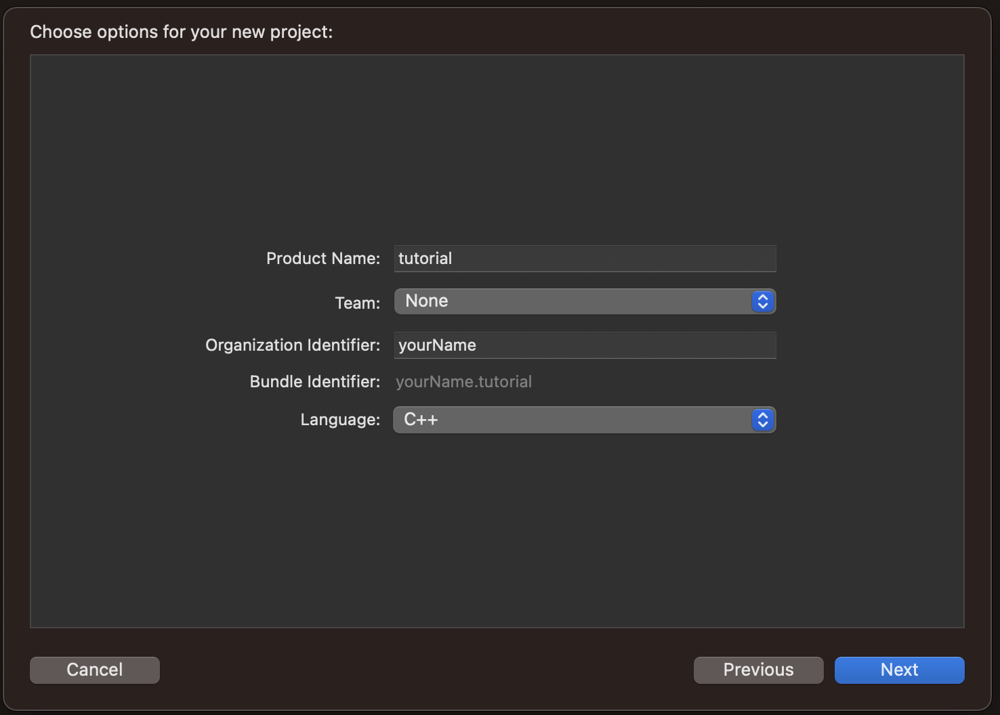

## Step 5: Navigate to Frameworks and Libraries
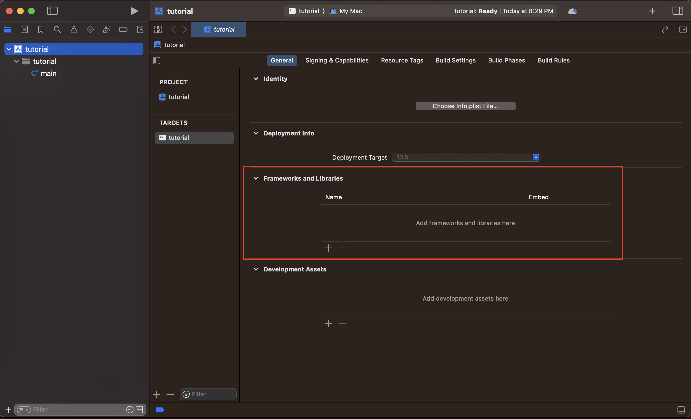
### Step 5.1: Add SFML Frameworks (click + button)
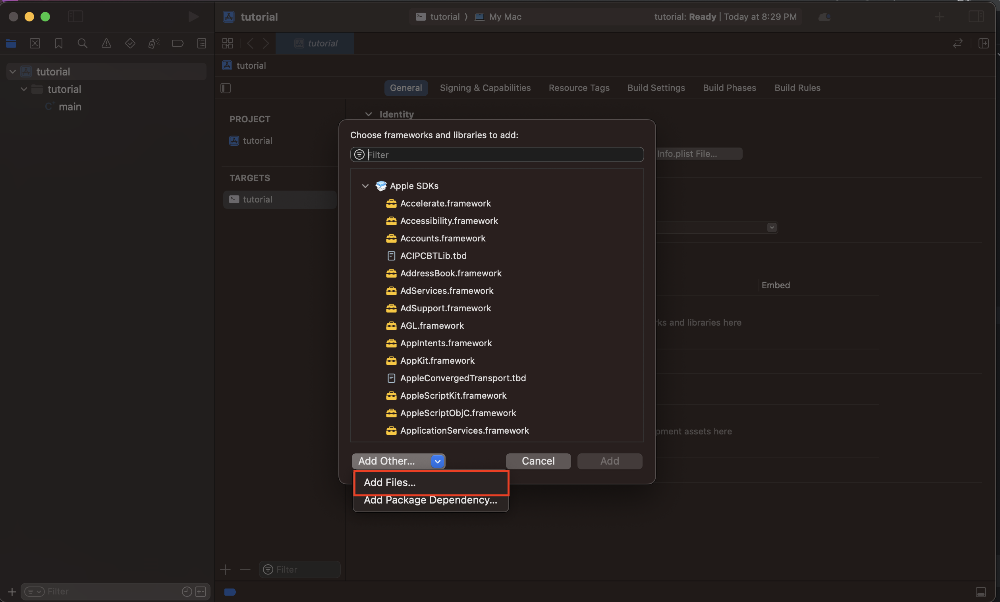
### Step 5.2: Navigate to SFML install location
```
open /opt/homebrew/Cellar/sfml/(YOUR VERSION HERE)/lib
```
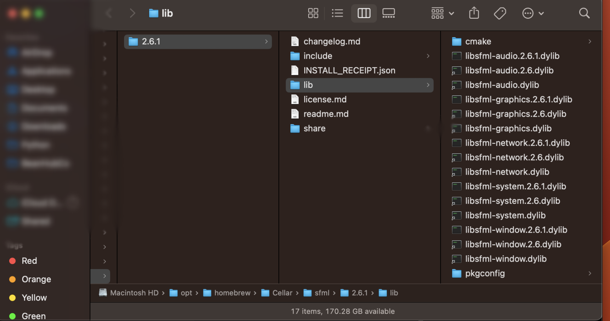

### Step 5.3: Add all the frameworks (place XCode window next to Finder window)
**Make sure to only add only the ones without any version numbers**
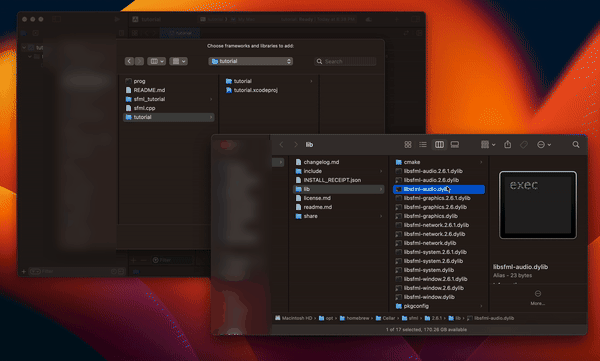

### Step 5.4: Repeat 5.3 to add rest of the frameworks (graphics, network, system, window)

### Step 5.5 Edit Build Settings
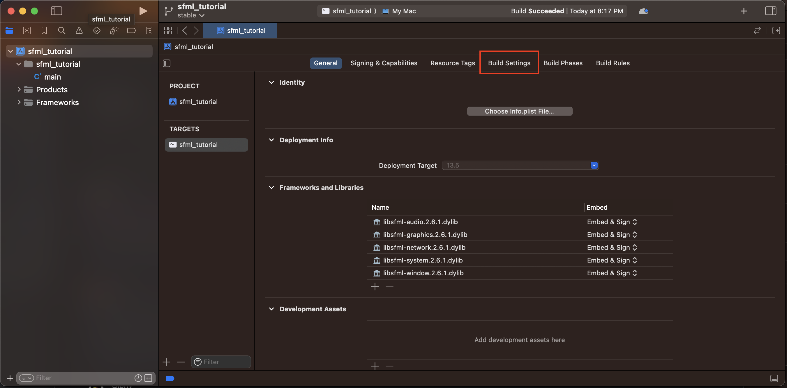
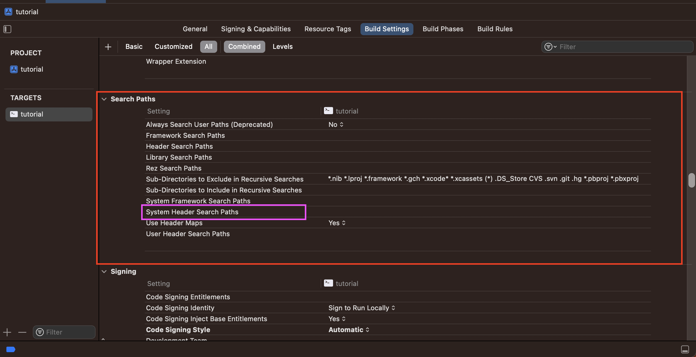
#### Add the following paths to the search paths
```
/opt/homebrew/Cellar/sfml/(YOUR VERSION HERE)/include
```
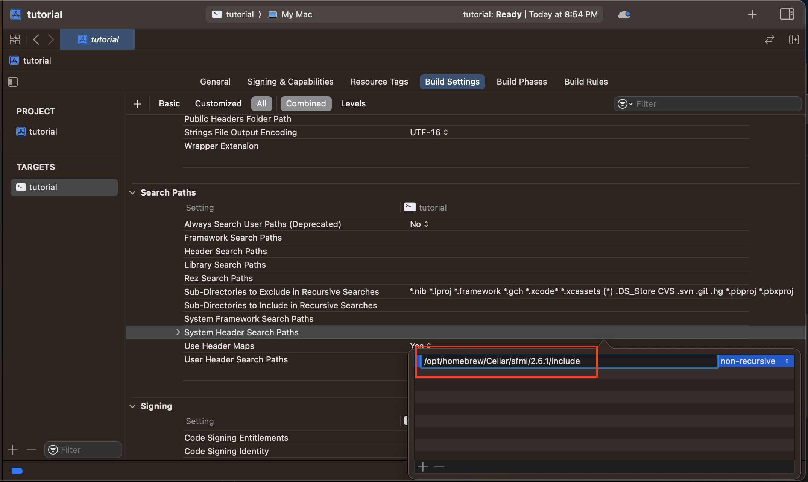

## Almost Done!

## Step 6: Paste Sample Code in main.cpp

**Paste in this code**
```
#include <SFML/Graphics.hpp>

int main()
{
    sf::RenderWindow window(sf::VideoMode(200, 200), "SFML works!");
    sf::CircleShape shape(100.f);
    shape.setFillColor(sf::Color::Green);

    while (window.isOpen())
    {
        sf::Event event;
        while (window.pollEvent(event))
        {
            if (event.type == sf::Event::Closed)
                window.close();
        }

        window.clear();
        window.draw(shape);
        window.display();
    }

    return 0;
}
```
**END**

## Step 7: Run the code!
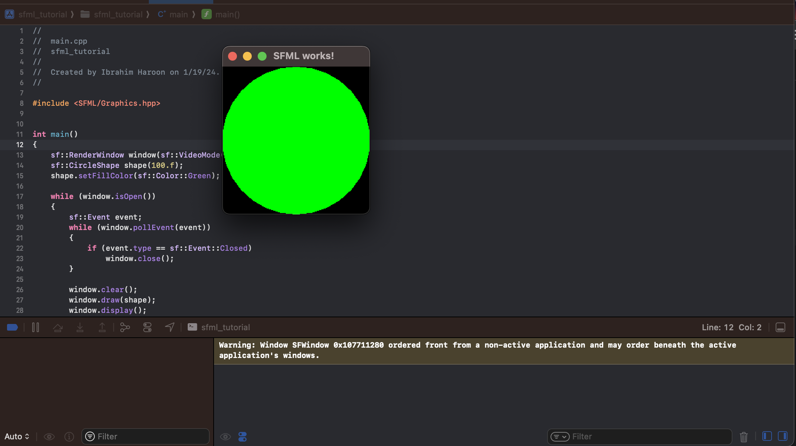


